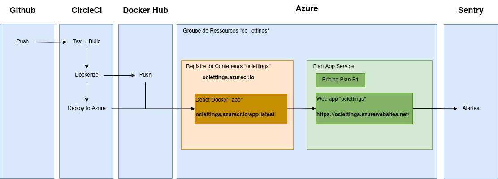

# OC Lettings

[](https://www.python.org/)
[](https://app.circleci.com/pipelines/github/rducrot/oc_lettings)
[](https://hub.docker.com/repository/docker/rducrot/oc_lettings/general)
[](https://oclettings.azurewebsites.net/)
[](https://romain-ducrot.sentry.io/projects/oc_lettings/?project=4505164231409664)

## Résumé

Site web d'Orange County Lettings

## Développement local

### Prérequis

- Compte GitHub avec accès en lecture à ce repository
- Git CLI
- SQLite3 CLI
- Interpréteur Python, version 3.10 ou supérieure

Dans le reste de la documentation sur le développement local, il est supposé que la commande `python` de votre OS shell exécute l'interpréteur Python ci-dessus (à moins qu'un environnement virtuel ne soit activé).

### macOS / Linux

#### Cloner le repository

- `cd /path/to/put/project/in`
- `git clone https://github.com/OpenClassrooms-Student-Center/Python-OC-Lettings-FR.git`

#### Créer l'environnement virtuel

- `cd /path/to/Python-OC-Lettings-FR`
- `python -m venv venv`
- `apt-get install python3-venv` (Si l'étape précédente comporte des erreurs avec un paquet non trouvé sur Ubuntu)
- Activer l'environnement `source venv/bin/activate`
- Confirmer que la commande `python` exécute l'interpréteur Python dans l'environnement virtuel
`which python`
- Confirmer que la version de l'interpréteur Python est la version 3.6 ou supérieure `python --version`
- Confirmer que la commande `pip` exécute l'exécutable pip dans l'environnement virtuel, `which pip`
- Pour désactiver l'environnement, `deactivate`

#### Créer les variables d'environnement

Pour pouvoir exécuter le site, il est nécessaire de créer un fichier `.env` dans le dossier `oc_lettings/oc_lettings_site/` et d'y inclure les informations suivantes :

```dotenv
SECRET_KEY=your_secret_key
AZURE_WEB_APP=your_azure_web_app_name
SENTRY_DSN=your_sentry_dsn
```

#### Exécuter le site

- `cd /path/to/Python-OC-Lettings-FR`
- `source venv/bin/activate`
- `pip install --requirement requirements.txt`
- `python manage.py runserver`
- Aller sur `http://localhost:8000` dans un navigateur.
- Confirmer que le site fonctionne et qu'il est possible de naviguer (vous devriez voir plusieurs profils et locations).

#### Linting

- `cd /path/to/Python-OC-Lettings-FR`
- `source venv/bin/activate`
- `flake8`

#### Tests unitaires

- `cd /path/to/Python-OC-Lettings-FR`
- `source venv/bin/activate`
- `pytest`

#### Base de données

- `cd /path/to/Python-OC-Lettings-FR`
- Ouvrir une session shell `sqlite3`
- Se connecter à la base de données `.open oc-lettings-site.sqlite3`
- Afficher les tables dans la base de données `.tables`
- Afficher les colonnes dans le tableau des profils, `pragma table_info(Python-OC-Lettings-FR_profile);`
- Lancer une requête sur la table des profils, `select user_id, favorite_city from
  Python-OC-Lettings-FR_profile where favorite_city like 'B%';`
- `.quit` pour quitter

#### Panel d'administration

- Aller sur `http://localhost:8000/admin`
- Connectez-vous avec l'utilisateur `admin`, mot de passe `Abc1234!`

### Windows

Utilisation de PowerShell, comme ci-dessus sauf :

- Pour activer l'environnement virtuel, `.\venv\Scripts\Activate.ps1` 
- Remplacer `which <my-command>` par `(Get-Command <my-command>).Path`

## Déploiement

### Prérequis

Afin de procéder au déploiement de l'application, il est nécessaire d'avoir un compte sur les plateformes suivantes :

- [Github](https://github.com)
- [CircleCI](https://app.circleci.com)
- [Docker](https://hub.docker.com)
- [Azure](https://portal.azure.com)
- [Sentry](https://sentry.io)

### Description

À chaque commit envoyé sur **Github**, la pipeline **CircleCI** est déclenchée et exécute les actions suivantes :
- Tests du code et linting. Si les tests ne renvoient pas d'erreur, l'étape suivante est déclencée.
- Création de l'image docker et envoi sur le **Docker Hub**.
- Envoi de l'image Docker sur le **registre de conteneurs Azure**.

Le conteneur est ensuite déployé sur une **App Service Azure**.

Le suivi des erreurs est effectué sur **Sentry**.

Ci-dessous une illustration des étapes du déploiement :



### CircleCI

Les variables suivantes ont été créées dans l'espace du projet :

| Nom de variable          | Description                                       | 
|--------------------------|---------------------------------------------------|
| AZURE_LOGIN_SERVER_NAME  | URI du conteneur de registres                     |
| AZURE_REGISTRY_NAME      | Nom du conteneur de registres                     |
| AZURE_REPO               | Nom du l'image sur Azure                          |
| AZURE_SP                 | Nom de l'utilisateur Azure (Principal de service) |
| AZURE_SP_PASSWORD        | Mot de passe de l'utilisateur Azure               |
| AZURE_SP_TENANT          | Tenant de l'utilisateur                           |
| DOCKER_LOGIN             | Login Docker                                      |
| DOCKER_PASSWORD          | Mot de passe Docker                               |
| DOCKER_PROJECT_REPO_NAME | Nom du projet Docker                              |
| DOCKER_PROJECT_USERNAME  | Nom de l'espace du projet Docker                  |

### Docker

Le tag de chaque image est généré lors de l'exécution du pipeline CircleCI à l'aide d'un hash sha-1. Voir la documentation de [l'orb CircleCI Docker](https://circleci.com/developer/orbs/orb/circleci/docker#usage-examples).

### Azure

#### Azure Container Registry

Le registre sur lequel est envoyée chaque version de l'image de l'application. Voir la documentation de [l'orb CircleCI Azure ACR](https://circleci.com/developer/orbs/orb/circleci/azure-acr).

#### Azure App Service

Définit l'URL de l'application. Se base sur le registre de conteneurs pour récupérer l'image.

Les variables suivantes ont été créées sur l'**App Service**. Elles sont utilisées par l'image Docker (équivalent du `.env`local) :

| Nom de variable          | Description                                      | 
|--------------------------|--------------------------------------------------|
| SECRET_KEY               | Clé secrète de l'application Django              |
| AZURE_WEB_APP            | Nom de l'application (utilisé par ALLOWED_HOSTS) |
| SENTRY_DSN               | Sentry Data Source Name                          |

### Sentry

Pour s'assurer que le suivi des erreurs fonctionne, il est possible de provoquer une erreur depuis l'adresse adresse_du_site/sentry_error.
